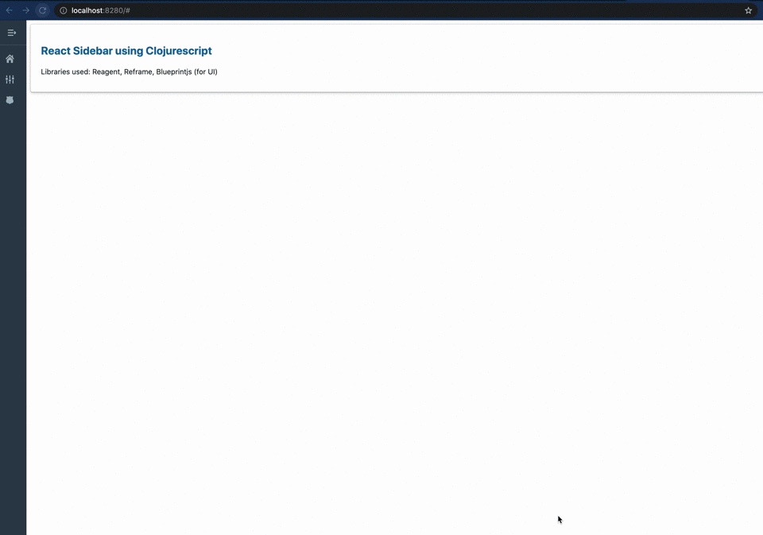

# react-sidebar-cljs

An Example on showing how to create a sidebar using React and Clojurescript.



## Getting Started

### Project Overview

* Architecture:
[Single Page Application (SPA)](https://en.wikipedia.org/wiki/Single-page_application)
* Languages
  - Front end is [ClojureScript](https://clojurescript.org/) with ([re-frame](https://github.com/day8/re-frame))
* Dependencies
  - UI framework: [re-frame](https://github.com/day8/re-frame)
  ([docs](https://github.com/day8/re-frame/blob/master/docs/README.md),
  [FAQs](https://github.com/day8/re-frame/blob/master/docs/FAQs/README.md)) ->
  [Reagent](https://github.com/reagent-project/reagent) ->
  [React](https://github.com/facebook/react)
* Build tools
  - CLJS compilation, dependency management, REPL, & hot reload: [`shadow-cljs`](https://github.com/thheller/shadow-cljs)
* Development tools
  - Debugging: [CLJS DevTools](https://github.com/binaryage/cljs-devtools)

#### Directory structure

* [`resources/public/`](resources/public/): SPA root directory
* [`src/react_sidebar_cljs/`](src/react_sidebar_cljs/): SPA source files (ClojureScript)

### Environment Setup

1. Install [JDK 8 or later](https://openjdk.java.net/install/) (Java Development Kit)
2. Install [Node.js](https://nodejs.org/) (JavaScript runtime environment) which should include
   [NPM](https://docs.npmjs.com/cli/npm) or if your Node.js installation does not include NPM also install it.
3. Clone this repo and open a terminal in the `react-sidebar-cljs` project root directory


### Running the App

Start a temporary local web server, build the app with the `dev` profile, and serve the app,
browser test runner and karma test runner with hot reload:

```sh
npm install
npm run watch
```

Please be patient; it may take over 20 seconds to see any output, and over 40 seconds to complete.

When `[:app] Build completed` appears in the output, browse to
[http://localhost:8280/](http://localhost:8280/).

[`shadow-cljs`](https://github.com/thheller/shadow-cljs) will automatically push ClojureScript code
changes to your browser on save.

